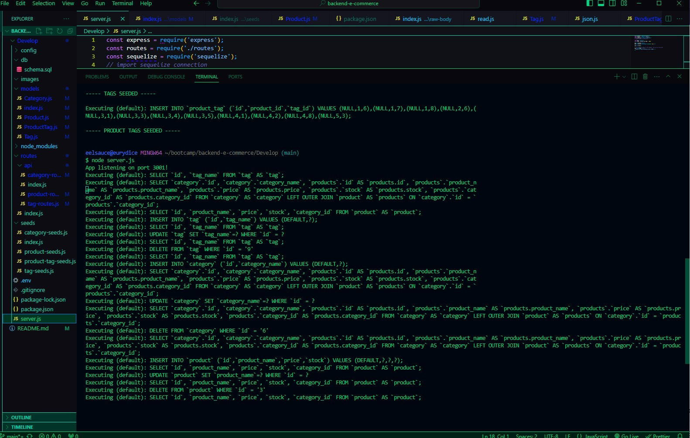
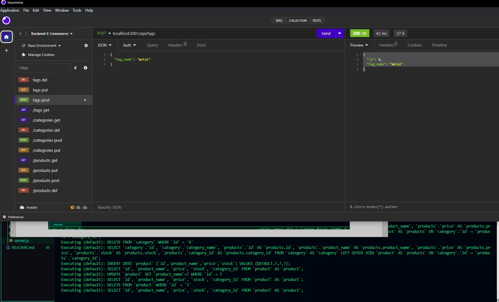
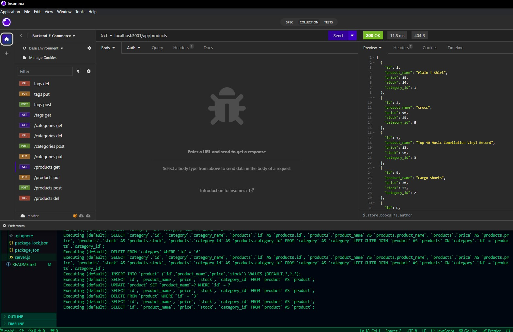

# Backend E-Commerce Application

A command-line application that let's you use the command line to track your e-commerce.

[](https://opensource.org/licenses/MIT)

---

## Contents

1. [About](#about)
   1. [Visuals](#visuals)
2. [Installation](#installation)
3. [License](#license)
4. [Contributing](#contributing)
5. [Contact](#contact)

---

## About

This application is a backend information storage for e-commerce, making it easy to edit, delete and alter information quickly. It's tested with Insomnia Core.

---

### User Story

```
AS A manager at an internet retail company
I WANT a back end for my e-commerce website that uses the latest technologies
SO THAT my company can compete with other e-commerce companies
```

## Visuals:





Walkthrough video of this application: https://drive.google.com/file/d/19zzGNp8tDBi-jmUzyjV14pI4Qvs8AIqq/view?usp=sharing

---

## Installation:

To clone the repo:

git clone in gitbash

```

```

---

## License

License used for this project - MIT

- For more information on license types, please reference this website
  for additional licensing information - [https://choosealicense.com/](https://choosealicense.com/).

---

## Contributing:

To contribute to this application, create a pull request.
Here are the steps needed for doing that:

- Fork the repo
- Create a feature branch (git checkout -b NAME-HERE)
- Commit your new feature (git commit -m 'Add some feature')
- Push your branch (git push)
- Create a new Pull Request

Following a code review, your feature will be merged.

---

## Contact:

- GitHub Username: [conquerersHaki](https://github.com/conquerersHaki)
- GitHub Email: keighleychristina@yahoo
